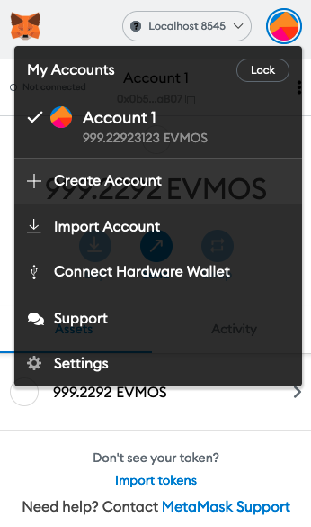
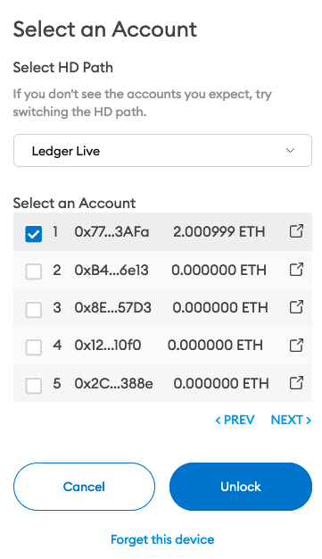
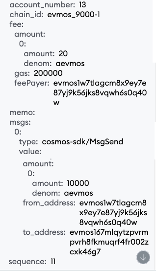
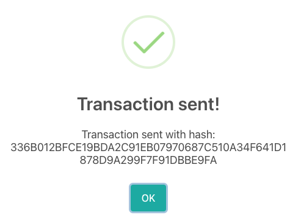

<!--
order: 5
-->

# Ledger

Get started with your Ledger hardware wallet on Evmos {synopsis}

## Pre-requisites

- [Ledger device](https://shop.ledger.com/) {prereq}
- [Install Ledger Live](https://www.ledger.com/ledger-live) {prereq}
- [Install Metamask](https://metamask.io) {prereq}

## Checklist

- ✅ Ledger [Nano X](https://shop.ledger.com/pages/ledger-nano-x) or
  [Nano S+](https://shop.ledger.com/products/ledger-nano-s-plus) device (compare
  [here](https://shop.ledger.com/pages/hardware-wallets-comparison))
- ✅ [Ledger Live](https://www.ledger.com/ledger-live) installed
- ✅ [Metamask](https://metamask.io) installed
- ✅ Ethereum Ledger app installed
- ✅ Latest Versions (Firmware and Ethereum app)

## Introduction

[Ledger](https://www.ledger.com/)'s hardware wallets are cryptocurrency wallets
that are used to store private keys offline.

> “Hardware wallets are a form of offline storage. A hardware wallet is a
> cryptocurrency wallet that stores the user's private keys (a critical piece of
> information used to authorize outgoing transactions on the blockchain network)
> in a secure hardware device.”
> [Investopedia](https://www.investopedia.com/terms/l/ledger-wallet.asp)

## Installation

## Ethereum Ledger App

If you want to connect to Evmos mainnet and Evmos testnet, you can use the
Ethereum Ledger app on Ledger Live by setting the chain ID.

First, you will need to install the Ethereum Ledger app by following the
instructions below:

1. Open up Ledger Live app on your Desktop
2. Select **Manager** from the menu
3. Connect and unlock your device (this must be done before installation)
4. In the **App catalog** search for `Ethereum (ETH)` and click **Install**.
   Your Ledger device will show **Processing** and once the installation is
   complete, the app will appear on your Ledger device

In the Ledger Live app, you should see the Ethereum app listed under the **Apps
installed** tab on the **Manager** page. After the app has been successfully
installed, you can close out of Ledger Live.

### Chain IDs

In the table below you can find a list of Chain IDs to use with the Ethereum
Ledger app.

|               | EIP155 chain ID |
| ------------- | --------------- |
| Evmos mainnet | `9001`          |
| Evmos testnet | `9000`          |

## Import your Ledger Account

### Metamask

Now that you've installed the app on Ledger Live, you can connect your Ledger to
your computer and unlock it with your PIN-code and open the Ethereum app.

::: tip Follow our [Metamask Guide](./metamask.md) to add the Evmos Mainnet and
Testnet to your Settings :::

Now you can import your Ledger account to MetaMask by using the following steps:

1. Click on connect hardware wallet



2. Select Ledger hardware wallet


3. Select your connected Ledger Device


4. Import the hex addresses that you want to use



### Evmos CLI

To use your Ledger with the Evmos CLI, first connect your device to your
computer, unlock it using your PIN, and open the Ethereum app.

Then, connect your Ledger to the CLI with `keys add` command, and select a name
for your device:

```
evmosd keys add NAME --ledger
```

**Example:**

```
evmosd keys add myledger --ledger

- address: evmos1hnmrdr0jc2ve3ycxft0gcjjtrdkncpmmkeamf9
  name: myledger
  pubkey: '{"@type":"/ethermint.crypto.v1.ethsecp256k1.PubKey","key":"A19Ty8NGmXQj/oQ+LubST9eDIhEACmWXW6gdU8h60eXI"}'
  type: ledger
```

To sign any transaction, simply append `--from myledger` to the end of the
command to indicate that the Ledger account should be used to authenticate the
message:

**Example:**

```
evmosd tx bank send myledger evmos1hnmrdr0jc2ve3ycxft0gcjjtrdkncpmmkeamf9 100000aevmos --fees 2000aevmos --from myledger
```

Now, you can use your Ledger as you would normally interact with the CLI.

## EIP712 signing

In order to sign Cosmos transactions (staking, voting on proposals, IBC
transfers), with Ledger hardware wallets, we implemented EIP712.

EIP712 means that the signer will generate a signature for something like a JSON
representation of the Cosmos transaction and that signature will be included in
the Cosmos transaction itself.

### Step-by Cosmos transaction using Evmos.me

1. **Get your address in both encodings**

After connecting the Ledger wallet to Metamask and connecting to the
<https://evmos.me> webpage, it will display our wallet
formatted on `bech32` and `hex` representation, we need these values to make
sure that the message that we are going to sign is the correct one.


2. **Create a Cosmos transaction**

In this example, we are going to create a simple message to send tokens to a
recipient\*.\*


After clicking `Send Coins`, Metamask will ask us to sign the typed message

3. **Sign with Metamask and Ledger**


You can see the complete message to be signed



4. **Validate the data before signing!**

- `feePayer`: represents the wallet that is signing the message. So it MUST
  match yours, if it’s different your transaction will be invalid.
- `fee`: amount to be paid to send the transaction.
- `gas`: max gas that can be spent by this transaction (aka gas limit).
- `memo`: transaction note or comment.
- `msgs`: This is the content of the cosmos transaction, in this example, we
  need to make sure that we are using a MsgSend, and that the *to_address* is
  the one that we want to send the founds. Also, we can verify that we are
  actually sending *10000aevmos* to that wallet.

### Ledger signing

If you have a Ledger connected to Metamask, you need to use it to sign the
message.

The Ledger device will display the domain hash and message hash before asking
you to sign the transaction.


**Broadcast the transaction**

After signing the message, that signature needs to be added to the cosmos
transaction and broadcasted to the network.

This step should be done automatically by the same service that generated the
message, in this case, [evmos.me](http://evmos.me) will broadcast the
transaction for you.



### Common errors

- Make sure that the Ethereum Ledger app is installed. The Cosmos Ledger app is
  not supported on the Evmos chain at the moment (see [FAQ](#faq)).
- Make sure you have created at least one Ethereum address on the Ledger
  Ethereum app.
- Make sure the Ledger device is unlocked and with the Ledger Ethereum app
  opened before starting the importing process.

### Known issues

- The denomination displayed as `ETH` when importing the wallet because we are
  using the Ethereum app.
- If you have Metamask correctly configured, the balance on the extension will
  be displayed as `EVMOS`, but on the Ledger device it will be displayed as
  `ETH`.

::: warning **IMPORTANT:** Make sure you are on the correct network before
signing any transaction! :::

## FAQ

1. **How can I generate Cosmos `secp256k1` keys with Ledger?**

Cosmos `secp256k1` keys are not supported on Evmos with Ledger. Only Ethereum
keys (`eth_secp256k1`) can be generated with Ledger.

2. **My Ledger has trouble connecting or signing on the CLI**

The Ledger's connection to the CLI can fail for a number of reasons. Make sure
to close any other apps using the Ledger (such as Ledger Live or Metamask),
unlock the Ledger, and open the Ethereum app. If this does not work, simply
disconnecting and reconnecting the device often solves the issue.

3. **I can’t use Metamask or Keplr with the Cosmos Ledger app**

Since Evmos only support Ethereum keys and uses the same HD path as Ethereum,
the Cosmos Ledger app doesn’t work to sign cosmos transactions.

<!-- 4. **I can’t use Ledger for my validator**

Validators can use [`EIP712`](#eip712-signing) with their Ethereum Ledger app to sign transactions. If you are using an existing Cosmos `secp256k1` key, it won't work -->
